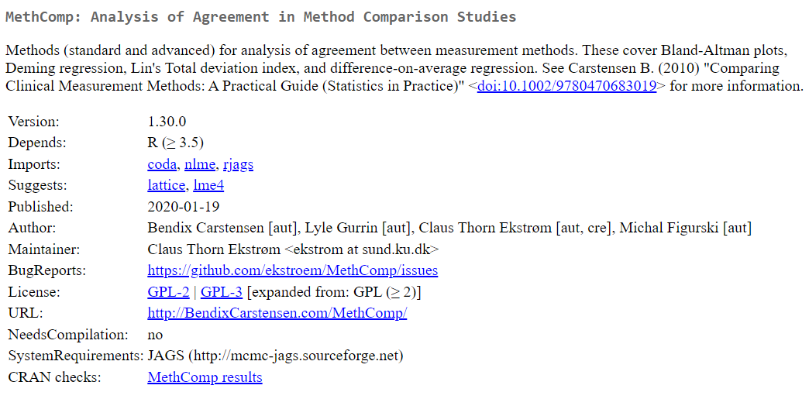

### Deming Regression

* Orthogonal regression (also known as “Deming regression”) examines the linear relationship between two continuous variables. 

* Unlike simple linear regression, ***both the response and predictor in orthogonal regression contain measurement error***. In simple regression, only the response variable contains measurement error.


* It’s often used to test whether two instruments or methods are measuring the same thing, and is most commonly used in clinical sciences to test the equivalence of measurement instruments. This is an extremely common use case (see Bland-Altman plot)


---





---

### {MethComp} R package

```{r warning=FALSE}
library(MethComp)

# 'True' values
M <- runif(100,0,5)

# Measurements - with generated error terms
x <- M + rnorm(100)
y <- 2 + 3 * M + rnorm(100,sd=2)

```

---

### {MethComp} R package

#### Deming regression with equal variances

```{r warnings=FALSE}
Deming(x,y)
```

#### Specifying the Variance Ratio as 2

```{r warnings=FALSE}
Deming(x,y,vr=2)
```

---

### {MethComp} R package

OLS Model Estimates

```{r warnings=FALSE}
# Comparing classical regression and "Deming extreme"
summary(lm(y~x))


```

---


### {MethComp} R package

* Blue: OLS Regression
* Red : Deming Regression

```{r warning=FALSE, echo=FALSE}
# Plot data with the two classical regression lines
plot(x,y, pch=16)
abline(lm(y~x),col="blue")
#ir <- coef(lm(x~y))
#abline(-ir[1]/ir[2],1/ir[2])
abline(Deming(x,y,vr=2)[1:2],col="red")
#abline(Deming(x,y,sdr=10)[1:2],col="blue")
```

---


### {MethComp} R package

Bootstrap Estimates

```{r warnings=FALSE}
Deming(x,y,boot=TRUE)
```

---
