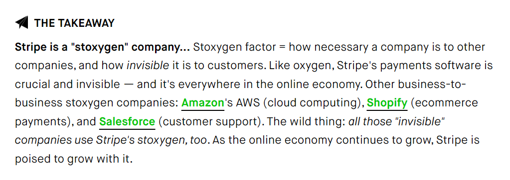
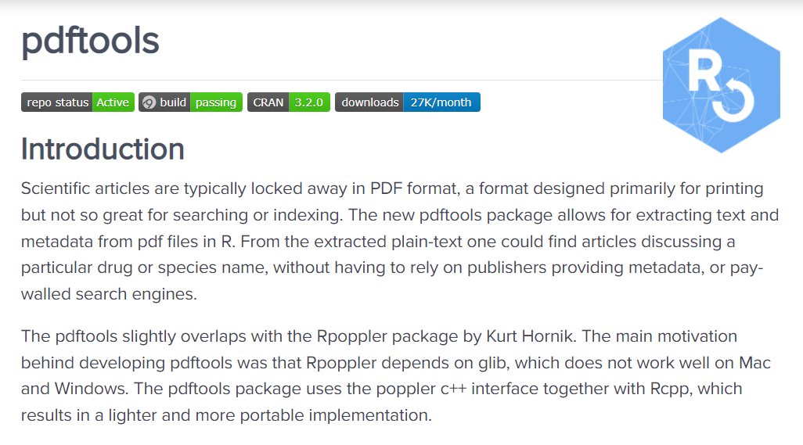
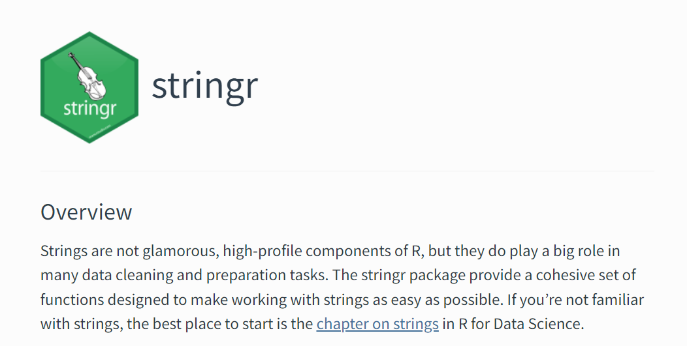
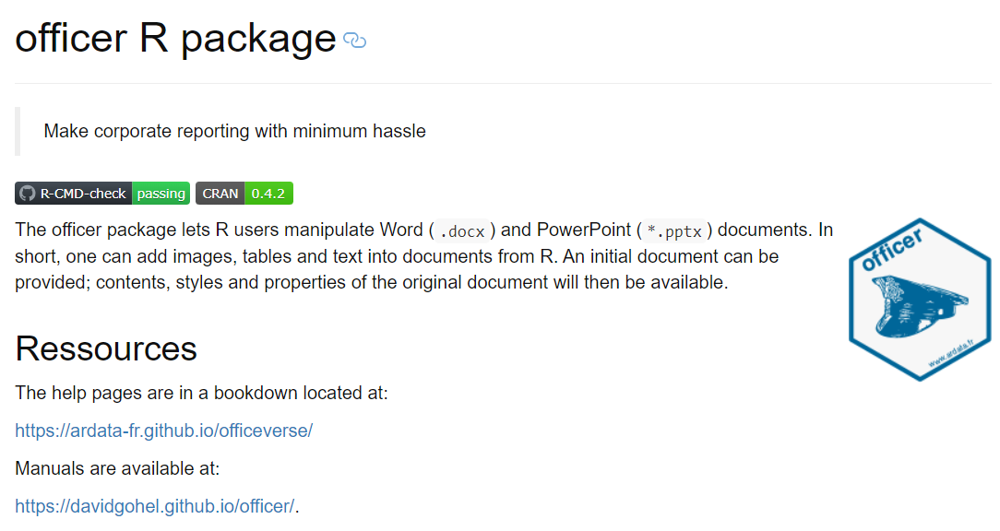
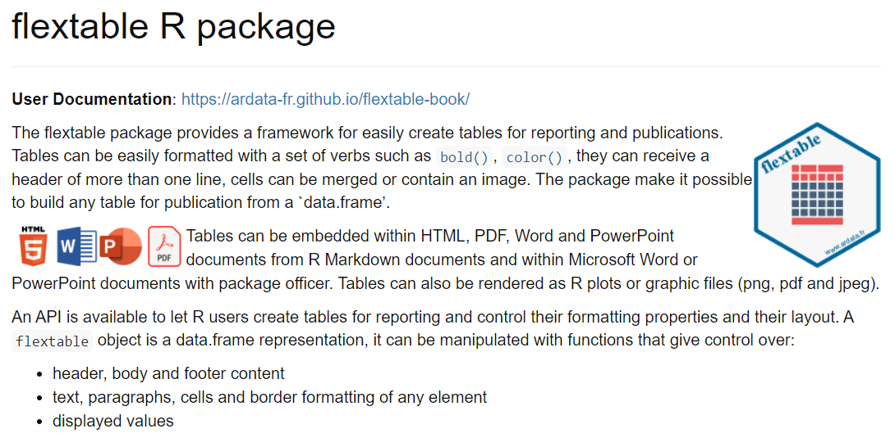
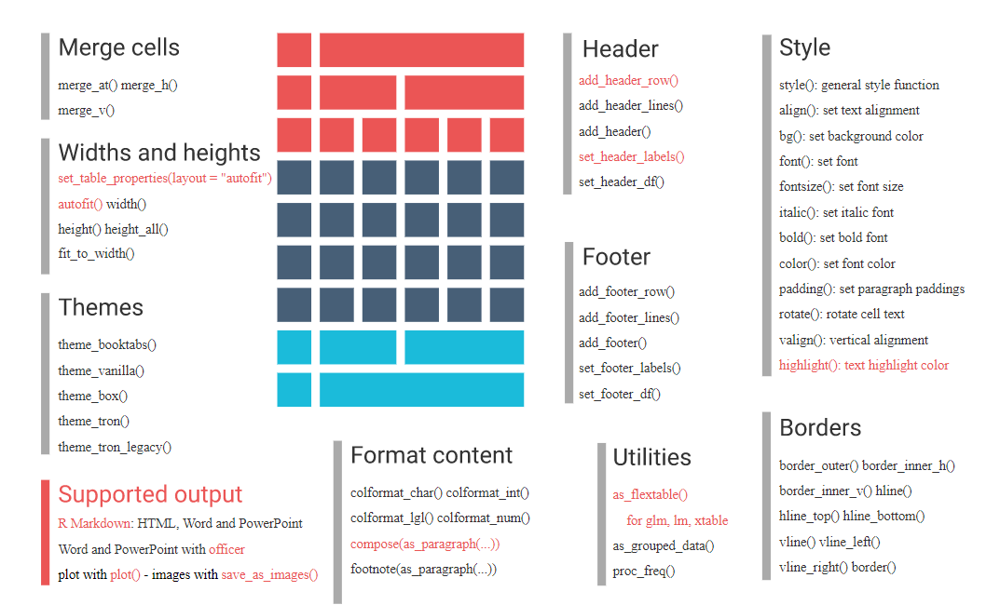

* Kevin O'Brien
* Forestry Data Scientist based in the West of Ireland
* R is very useful in Forestry - Statistical Analysis and Data Visualization
* Other R packages have been ***VERY*** useful

---

---

### Stripe

---

### Lessons to learn 

* Think like a manager

* Try to avoid a lot of tedious and unnecessary work (data entry work)

* boost productivity

---

### Come to the Dark Side

Careet Strategy: Think about tedious boring jobs that can be automated, and processes that can be made more efficient

---

### Working with Documents

* Forestry is highly regulated in Ireland (Water quality, natural heritage, habitats)
* Lots of documents
* Government agencies strongly prefer Microsoft Word and PDFs
* Time consuming

---

### PDF Tools

---

### Usage

<pre> <code>
pdf_info(pdf, opw = "", upw = "")

pdf_text(pdf, opw = "", upw = "")

pdf_data(pdf, font_info = FALSE, opw = "", upw = "")

pdf_fonts(pdf, opw = "", upw = "")

pdf_attachments(pdf, opw = "", upw = "")

pdf_toc(pdf, opw = "", upw = "")

pdf_pagesize(pdf, opw = "", upw = "")

</code></pre>

---

### Stringr

Processing Text with R

Also - Regular Expressions with R
(R-Ladies Gaborone)

---

### Officerverse

* David Gohel

* https://www.ardata.fr/
* davidgohel.github.io

#### R Packages

* Officer 
* Flextable 
* Officedown

---

### Officer R Package

Automated Generation of Word Documents with R

---

### Officer R Package

#### Examples

<pre><code>
my_doc <- read_docx() %>%
      body_add_par(value='Some text etc etc') %>%
      body_add_flextable(value=ft) %>% 
      body_add_break()
      
</code></pre>      

* Formatted Text
* Add Images
---

### Flextable R Package

Automated Generation of Tables with R

---

### Flextable R Package

Automated Generation of Tables with R

---

### Useful R packages

* tidyverse
* janitor
* scales

---

