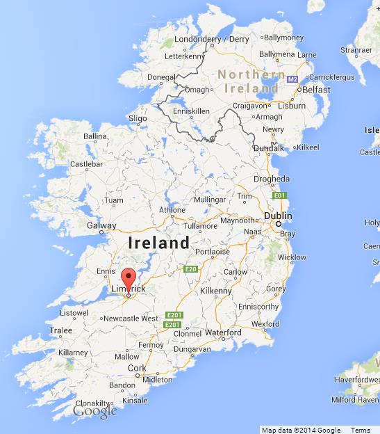

### About me
* Kevin O'Brien
* Forestry Data Scientist based in the West of Ireland 
  - Also in London, UK a lot
* R is very useful in Forestry - Statistical Analysis and Data Visualization
* Other R packages have been ***VERY*** useful 

---




---

### My career

Former University Lecturer of Mathematics and Statistics. 

####  Motivation
* Career young data scientists, mathematicians and statisticians. 
* Job interviews. 
* Career advice. 
* Professional development. 

#### Students
* Maths and Statistics Students (Teaching R)
* Health sciences, Life Sciences, Equine science, Sports Science, Food science, Biochemistry 

(Emphasizing the second group more - as those subjects area have very interesting real-world applications.)

---

### Topics

* Statistics 101
* Exploratory Data Analysis
* Linear models. 
  * Robust, Polynomial Regression
  * Model Metrics
* Experimental design. 
* Linear Mixed Effects models. 
* Non-Parametric Statistics.
* Statistical Process Control.


```{r child="scope.Rmd"}

```

---

### Pedagogical Effects on Statistics

(More the general science students, rather than the Maths Science students)

* Designing a Statistics course is an exercises in compromise, particularly Statistics 101 courses. For the curriculum design in universities, some choices are made that reflect scheduling needs. 

* 12-14 Week semesters with 2 or 3 lectures per week. Many students will have only 1, but maybe 2 Statistics Modules in their 4 year degree programme.

* Many would benefit from far more Statistics and Statistical Computing content on their curriculum.

* Lecturers must create a pen-and-paper exam paper at the end of the semester, with a transparent rubric. Conventions must be followed.

* Example: You ***MUST*** cover the Normal Distribution - but you are caught for time to explain all the reasons ***WHY*** it is so important to know.

* DANGER! Pedagogical design can create misconceptions about the relative importance of various statistical topics. 


---

### Job Advertisement (Financial Services)

The Data Scientist has a deep statistical knowledge and strong quantitative skills who will work as part of the Model Validation team to independently evaluate the efficacy of the design and implementation of [COMPANY]’s high performance modeling solutions across our Big Data analytics landscape.


Quantitative models support some of the most important processes and decisions at [COMPANY], and the Model Validation team is responsible for their effective challenge. 

The Model Validation team conducts testing and provides a ***critical review of conceptual soundness and model performance***, producing technical reports describing the results of validation, and interface with internal stakeholders and regulators to communicate findings in model risk. 

The Model Validation team assesses all models across [COMPANY] and this role offers the unique opportunity to acquire a wide variety of experience of different models supporting a wide range of relevant processes including credit risk, fraud etc. 


---


### Job Advertisement (Financial Services)

#### (Continued)

You will be responsible for sourcing and generating validation datasets, analysis and critical review of related data, assessment of model performance and ultimately delivering validation reports on the status of the underlying models. You will work with a wide, diverse range of data science/model development teams. 

You will have the opportunity to work with one of the world’s largest financial datasets and the most advanced analytics and machine learning approaches that deliver near real-time predictions and recommendations.

---


```{r child="TechnologyAcceptanceModel.Rmd"}


# Technology Acceptance Model
# Laxy User Model
# Later on: Bland Altman Plots
```

```{r child="lindia.Rmd"}

# Lindia
# Boxcox Transformations
```


```{r child="MethodComparisonStudies.Rmd"}

```


```{r child="UsefulRPackages.Rmd"}

```


