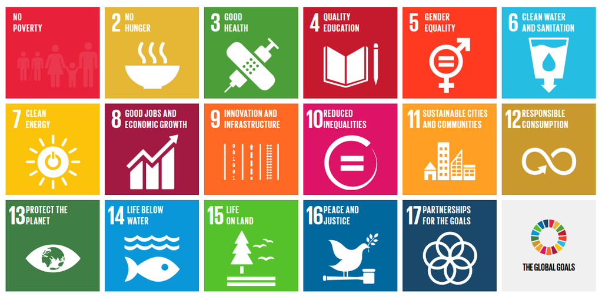

#### Sustainable Development Goals 

---

### Sustainable Development Goals 

**Sustainable Development Goal 2**
 -  ending hunger, achieving food security, improving nutrition and promoting sustainable agriculture.

**Sustainable Development Goal 3**
 -  ensuring healthy lives and promoting well-being for all, at all ages.

**Sustainable Development Goal 6**
 -  ensuring the availability and sustainable management of water and sanitation for all.

**Sustainable Development Goal 7**
 -  ensuring access to affordable, reliable, sustainable and modern energy for all.

---

### Sustainable Development Goals (more)

**Sustainable Development Goal 8**
 -  promoting sustained, inclusive and sustainable economic growth, full and productive employment and decent work for all.

**Sustainable Development Goal 11**
 -  making cities and human settlements inclusive, safe, resilient and sustainable.

**Sustainable Development Goal 12**
 -  ensuring sustainable consumption and production patterns.

**Sustainable Development Goal 13**
 -  taking urgent action to combat climate change and its impacts.

---

### Sustainable Development Goals (more)

**Sustainable Development Goal 14**
 -  conserving and using oceans, seas and marine resources sustainably.

**Sustainable Development Goal 15**
 -  protecting, restoring and promoting sustainable use of terrestrial ecosystems; sustainably managing forests; combating desertification, halting and reversing land degradation; and halting biodiversity loss.

**Sustainable Development Goal 16**
 -  promoting peaceful and inclusive societies for ***Sustainable Development, providing access to justice for all and building effective, accountable and inclusive institutions at all levels.

