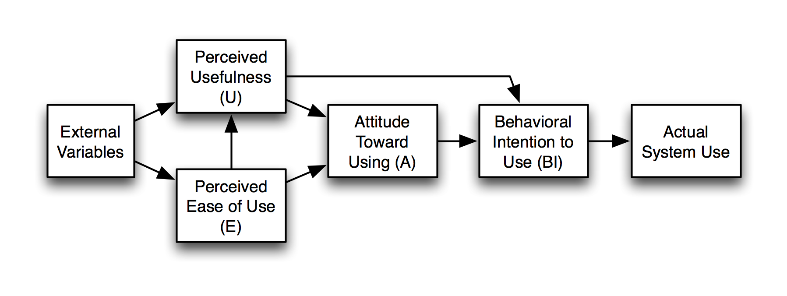

### Technology Acceptance Model

#### Why do people use some tools and not others?

**(Source: Wikipedia)**
---

### Technology Acceptance Model

***Perceived usefulness (PU)*** – This was defined by Fred Davis as "the degree to which a person believes that using a particular system would enhance their job performance". It means whether or not someone perceives that technology to be useful for what they want to do.

***Perceived ease-of-use (PEOU)*** – Davis defined this as "the degree to which a person believes that using a particular system would be free from effort" (Davis 1989). If the technology is easy to use, then the barriers conquered. If it's not easy to use and the interface is complicated, no one has a positive attitude towards it.

