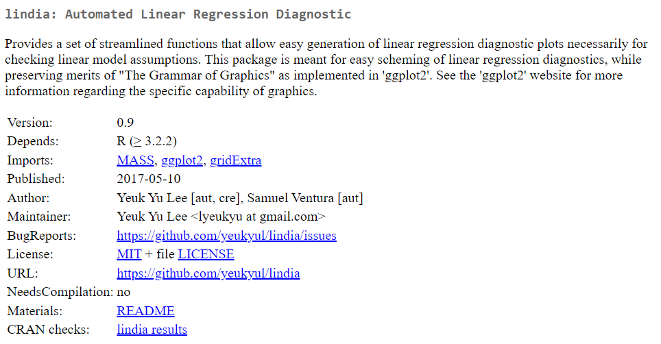

```{r warning=FALSE,message=FALSE}
library(lindia)

```

---

### Cars 93 Data

```{r}

library(MASS)
data(Cars93)

dim(Cars93)

names(Cars93)
```

---

```{r}

cars_lm <- lm(Price ~ Passengers + Length + RPM, data = Cars93)

summary(cars_lm)

```

---

```{r}


gg_cooksd(cars_lm)


```

---

```{r}

gg_diagnose(cars_lm)

```


---


```{r}

gg_resX(cars_lm)

```
---

```{r}
gg_qqplot(cars_lm) 
```

---

```{r}
gg_resfitted(cars_lm) 
```


---


```{r}

gg_boxcox(cars_lm)

```

---
